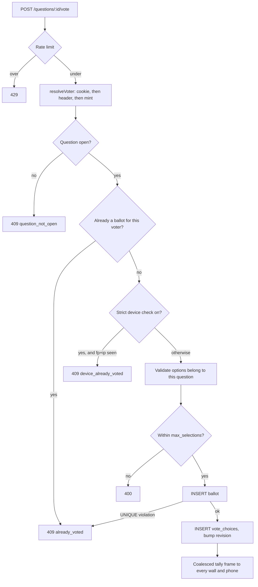
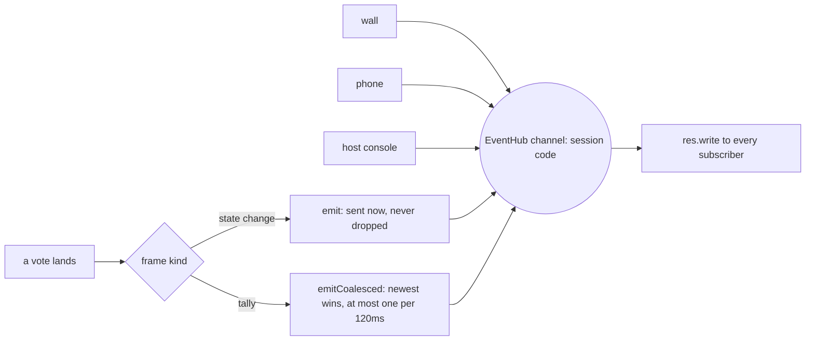

# VoteArena - Developer Documentation

Technical reference for the VoteArena codebase: architecture, identity model, data
model, API surface, and setup/deployment. For what the app does from a user's point of
view, see [README.md](./README.md).

## Table of contents

- [Tech stack](#tech-stack)
- [Architecture overview](#architecture-overview)
- [Identity and one-vote enforcement](#identity-and-one-vote-enforcement)
- [Host authorisation](#host-authorisation)
- [Live updates](#live-updates)
- [API surface](#api-surface)
- [Data model](#data-model)
- [Results visibility](#results-visibility)
- [Frontend structure](#frontend-structure)
- [Theming](#theming)
- [The bubble field](#the-bubble-field)
- [Environment variables](#environment-variables)
- [Local setup](#local-setup)
- [Continuous integration](#continuous-integration)
- [Testing](#testing)
- [Deployment](#deployment)
- [Gotchas](#gotchas)

## Tech stack

React 18 + TypeScript, built by Vite 6, routed with React Router 7. Plain CSS with
custom properties and CSS Modules - no utility framework, because the two surfaces
(a phone and a projector) need genuinely different type scales and a token layer was
simpler than fighting a preset. Fonts are self-hosted through `@fontsource-variable`
so an event on flaky venue Wi-Fi never waits on a font CDN.

The server is Express 4 on Node 22 with `better-sqlite3`. SQLite because the whole
thing is one process serving one room; a synchronous embedded database removes an
entire tier and is comfortably fast enough for a few hundred people. Live updates go
over Server-Sent Events rather than WebSockets - the traffic is one-directional
(server to screen), and SSE reconnects by itself.

## Architecture overview

```
  Phone (/v/:code)     Projector (/w/:code)     Host (/c/:code)
        │                      │                      │
        │  POST /vote          │  GET /stream (SSE)   │  admin routes
        └──────────┬───────────┴──────────┬───────────┘
                   │                      │
             ┌─────▼──────────────────────▼─────┐
             │        Express (server/)         │
             │  routes/ -> store.ts -> SQLite   │
             │        lib/events.ts (hub)       │
             └──────────────────┬───────────────┘
                                │
                        data/votearena.db
```

- **`server/routes/`** validates input with Zod, checks authorisation, and translates
  errors into a stable JSON shape. It never touches SQL.
- **`server/store.ts`** owns every query and every transaction. All the invariants that
  matter - one ballot per voter, one open question per session, write-in merging - live
  here, inside transactions, so a race cannot slip past them.
- **`server/lib/events.ts`** is the SSE fan-out hub, keyed by join code.
- **`shared/types.ts`** holds the DTOs both sides import. It has no runtime imports so
  the client and server bundles can each take it.

The client renders from a single live state (`src/lib/live.ts`) fed by the stream, so
the phone, the wall and the console all show the same thing without polling.

### What a vote actually does



Every one of those checks runs inside one transaction, and the `UNIQUE
(question_id, voter_id)` index is the real arbiter: the `SELECT` above it is a
courtesy that produces a nicer error, not the thing that makes voting once-only.
Two requests from the same phone racing each other both reach the insert, and
the index decides.

## Identity and one-vote enforcement

The hard guarantee is a database constraint, not application logic:

```sql
UNIQUE (question_id, voter_id)   -- on ballots
```

`voter_id` is resolved per request, in this order (`server/lib/identity.ts`):

1. the `va_voter` httpOnly cookie, HMAC-signed so it cannot be forged or hand-minted;
2. the same token echoed in an `X-Voter-Token` header, mirrored into `localStorage` by
   the client - this is what covers in-app browsers (Instagram, LinkedIn) and iOS
   Lockdown mode, which drop the cookie between page loads;
3. a freshly minted identity.

**The IP address is deliberately not the key.** A hall full of people behind one NAT
shares a single address; keying on it would let the first voter lock out everyone else.
The IP is HMAC-hashed and stored only as a signal - never in the clear - and is used
for rate limiting and for the optional strict check.

**Strict device check** (`sessions.strict_device_check`, off by default) additionally
rejects a ballot when the same `(fp_hash, ip_hash)` pair has already voted on that
question. The device print is a coarse signature - user agent, language, screen
geometry, timezone, core count, plus a per-profile random salt. It deliberately avoids
canvas, font and audio fingerprinting: it is a tie-breaker, not a tracking key. Two
identical phones on one network can collide, which is exactly why it is opt-in.

Concurrency: two simultaneous requests from one device both pass the `SELECT` check,
then one loses on the `UNIQUE` index. `castBallot` catches the constraint violation and
returns the same `already_voted` conflict, so the race is invisible to the caller.

## Host authorisation

Creating a session returns a 256-bit `adminToken`, shown once and stored in the
creating browser's `localStorage`. Only its HMAC lands in the database
(`sessions.admin_token_hash`), so a database dump does not hand over control of live
sessions. Every admin route compares in constant time via `safeEqual`.

There is no account system and no password reset. Losing the browser means losing
control of that session - deliberate, for a tool whose sessions last an evening.
`ADMIN_PASSWORD` optionally gates *creating* sessions on a public instance; it does not
gate control of an existing one.

## Live updates

### One channel per session



A burst of votes produces one frame every 120ms rather than one per vote, which
is the difference between a few frames a second and a few hundred in a room of
300. State changes are never coalesced, because dropping "the question closed"
would leave a phone showing a vote button that no longer works.


`GET /api/sessions/:code/stream` opens an SSE channel. Events:

| Event | Payload | When |
|---|---|---|
| `hello` | full public session + all tallies | immediately on connect |
| `session` | full public session | question added, opened, closed, edited, reordered, deleted; write-in created |
| `tally` | one question's counts | a vote lands |
| `ping` | `{ t }` | every 25s, to keep proxies from closing an idle stream |

`hello` carries the whole state, so a client never needs a second request to render,
and a reconnect re-syncs rather than patching.

**Tally frames are coalesced** (`EventHub.emitCoalesced`, 120ms): during a burst only
the newest count per question is sent and intermediate frames are dropped unsent. A
300-person room produces a few frames a second instead of a few hundred. State changes
use `emit` and are never dropped.

Each tally carries a `revision` that increases on every counting change. Clients ignore
a frame whose revision is below the highest they have seen, which stops an out-of-order
frame after a reconnect rolling the wall back. The counter is seeded from the ballot
count so a server restart cannot rewind it, and clients reset their high-water mark on
`hello`.

Compression is explicitly disabled for `text/event-stream` in `server/app.ts` - gzip
would hold frames in the encoder's buffer - and `X-Accel-Buffering: no` tells nginx the
same thing.

## API surface

All routes are under `/api`. Admin routes need `X-Admin-Token` (or
`Authorization: Bearer`).

| Method | Path | Who | Returns |
|---|---|---|---|
| GET | `/health` | anyone | `{ ok, version, env }` |
| POST | `/sessions` | anyone* | `{ session, adminToken }` |
| GET | `/sessions/:code` | anyone | public session (draft questions stripped) |
| GET | `/sessions/:code/admin` | host | full session + true tallies + viewer count |
| PATCH | `/sessions/:code` | host | title, status, current question, strict check |
| DELETE | `/sessions/:code` | host | `204` |
| GET | `/sessions/:code/me` | anyone | what this device has answered |
| GET | `/sessions/:code/stream` | anyone | SSE |
| POST | `/sessions/:code/questions` | host | `{ question }` |
| PATCH | `/questions/:id` | host | prompt, write-ins, max selections, visibility, position |
| DELETE | `/questions/:id` | host | `204` |
| POST | `/questions/:id/open` \| `/close` \| `/reset` | host | `{ question }` |
| POST | `/questions/:id/options` | host | `{ created, question }` |
| DELETE | `/options/:optionId` | host | `{ question }` |
| GET | `/questions/:id/results` | anyone | `{ tally }`, redacted unless visible or host |
| POST | `/questions/:id/vote` | anyone | `{ ballotId, selectedOptionIds, token, question, tally }` |

\* subject to `ALLOW_SESSION_CREATION` and `ADMIN_PASSWORD`.

Errors are always `{ error: { code, message, details? } }`. Conflicts carry a machine
reason in `details.reason`: `already_voted`, `device_already_voted`, `question_not_open`,
`session_ended`.

Rate limits: 30 session creations per IP per hour; 240 votes per IP per minute. The vote
limit is generous on purpose - it exists to stop a script, and a whole room can share
one NAT address, so it must never behave like a per-person limit. Duplicate-vote
prevention is the `UNIQUE` index, never the limiter.

## Data model

SQLite, WAL mode, foreign keys on. Schema in `server/db/schema.ts`, applied idempotently
at boot. **All timestamps are ISO 8601 UTC strings** (`new Date().toISOString()`).

**`sessions`** - `id`, `code` (unique, 6 chars), `title`, `status`
(`draft`|`live`|`ended`), `admin_token_hash`, `current_question_id`,
`strict_device_check` (0|1), `created_at`, `updated_at`.

**`questions`** - `id`, `session_id` -> sessions (cascade), `position`, `type`
(`fixed`|`pool`), `prompt`, `status` (`draft`|`open`|`closed`), `allow_write_in` (0|1),
`max_selections`, `results_visibility` (`live`|`after_close`|`hidden`), `opened_at`,
`closed_at`, `created_at`.

**`options`** - `id`, `question_id` -> questions (cascade), `label`, `normalized_label`,
`position`, `source` (`seed`|`write_in`), `created_at`.
`UNIQUE (question_id, normalized_label)` is what merges write-ins.
`normalizeLabel` folds case, Unicode accents (NFKD) and punctuation, so `José García`
and `jose garcia` collide by design. The first spelling seen wins the display label.
`position` is stable and drives the colour ramp, so a bubble keeps its colour as ranks
change and adjacent bars never share one.

**`ballots`** - `id`, `question_id` -> questions (cascade), `voter_id`, `ip_hash`,
`fp_hash`, `created_at`, `UNIQUE (question_id, voter_id)`. One row per voter per
question - this table *is* the one-vote rule.

**`vote_choices`** - `ballot_id` -> ballots (cascade), `option_id` -> options (cascade),
primary key on both. Splitting choices from ballots is what lets one question take
several answers from one person while still counting them as a single voter: `voters`
counts ballots, `selections` counts choices.

There is no `voters` table. Nothing is stored about a person beyond two salted hashes
and the fact that they voted.

## Results visibility

`tallyVisible` in `server/routes/serialize.ts` decides; `resultsRevealed` in
`src/lib/visibility.ts` mirrors it for rendering. The server is the authority and zeroes
the counts before they leave the process, so a hidden result is not merely hidden in
the UI - it is not in the payload.

`totalBallots` stays visible even when counts are redacted, so the wall can show
"28 votes in" without giving away the split. The host always sees true numbers.

## Frontend structure

```
src/
  pages/            one directory-level component per route
    console/        the host control room, split into editor / settings / new-question
  components/
    viz/            BubbleField (pool) and Leaderboard (fixed)
  lib/
    api.ts          typed fetch client, error mapping, admin-token storage
    live.ts         the SSE hook; single source of live state
    device.ts       voter token mirror and device print
    urls.ts         join/wall/console links, clipboard and share fallbacks
    visibility.ts   client mirror of the server's visibility rule
  styles/global.css design tokens, reset, shared primitives
shared/types.ts     DTOs imported by both client and server
server/             see Architecture overview
tests/              api.test.ts, stream.test.ts (vitest), e2e/ (Playwright)
```

## Theming

One dark theme. Tokens are defined once on `:root` in `src/styles/global.css`: surfaces
(`--ink` -> `--overlay`), text, accents, and an eight-colour categorical ramp
(`--c1`…`--c8`) shared by both visualisations. Spacing runs on a 4px scale (`--r1`…`--r8`).

The brand mark ships as one file, solid purple on transparent. `.logo-mono` applies
`brightness(0) invert(1)` to read on dark surfaces - `brightness(0)` flattens any opaque
pixel to black while keeping the alpha shape. Do not add a second recoloured file.

## The bubble field

`src/components/viz/BubbleField.tsx` is the most intricate component. Things that will
bite you:

- **Area, not radius, is proportional to votes.** Radius alone makes a 2× lead look like
  1.4×. The scale factor `k` is solved so the bubbles together fill a set share of the
  canvas.
- **Colour goes through `style`, never the `fill` attribute.** CSS custom properties
  resolve in CSS declarations but not in presentation attributes: `fill="var(--c1)"`
  silently renders black.
- **`forceCollide` caches radii on `initialize`, not per tick.** Bubbles grow between
  tallies, so the force is re-initialised (`syncRadii`) every paint. Skip it and
  everything overlaps.
- **React must not own node opacity or transform.** They are written every frame by
  `paint()`; a re-render that also set them would reset half-faded bubbles. The inline
  ref callback sets the initial opacity once, guarded, because React re-runs inline ref
  callbacks on every render.
- **A `useLayoutEffect` repaints after commit.** New nodes' refs only exist after the
  render lands; the rAF loop would catch up on its next frame, but the settled path has
  no next frame.
- **Two buttons in the console are both visibly labelled "Add"** (new question, and add
  options). They carry distinct `aria-label`s, so match on those rather than the text.
- **Settled mode.** When the tab is hidden (rAF is suspended) or the reader prefers
  reduced motion, the physics is run synchronously with `sim.tick(400)` and painted
  once. Radii must be applied *before* ticking, or collision runs at radius ~1 and the
  field collapses into concentric rings.
- **Labels are fitted to the chord, not the radius**, at roughly 0.62em per character
  for the display face at bold weight, and hidden when the result would be under 10px.

## Environment variables

Parsed and validated by Zod in `server/config.ts`; the process refuses to boot on bad
input. See `.env.example`.

| Variable | Default | Notes |
|---|---|---|
| `NODE_ENV` | `development` | `production` makes `SECRET_KEY` mandatory and cookies `Secure` |
| `PORT` | `4000` | |
| `HOST` | `0.0.0.0` | |
| `DATABASE_PATH` | `data/votearena.db` | `:memory:` is honoured, used by the tests |
| `PUBLIC_URL` | - | origin baked into QR codes and join links |
| `SECRET_KEY` | random | **required in production.** Signs voter cookies, hashes IPs |
| `TRUST_PROXY` | `0` | proxy hop count; a number, not `true`, so `X-Forwarded-For` cannot be spoofed |
| `ALLOW_SESSION_CREATION` | `true` | set false to lock a public instance |
| `ADMIN_PASSWORD` | - | optional shared password to create a session |

In development a random `SECRET_KEY` is generated per boot. That is fine locally, but in
production a restart would invalidate every voter cookie and let people vote a second
time - hence the hard requirement.

## Local setup

```sh
npm install
npm run dev          # Vite on :5173 proxying /api to the server on :4000
```

`npm run dev` runs both processes. The Vite proxy passes SSE through without buffering.

Other scripts:

```sh
npm run build        # client -> dist/client, server -> dist/server
npm start            # run the built server (serves the SPA itself)
npm run typecheck    # both tsconfigs
npm run lint
npm test             # vitest
npm run test:e2e     # Playwright, builds required first
```

## Continuous integration

`.github/workflows/ci.yml`, on push to `main` or `master`, on every pull request
and on demand. No scheduled run.

| Job | What it proves |
|---|---|
| `build` | lint, both typecheck projects, the unit suite with a coverage floor of 85%, and a production build, on Node 20.11 and 24. 20.11 is the floor `engines.node` declares |
| `e2e` | Playwright against `dist/server/server/index.js`, the real production build, not the dev server |
| `audit` | `npm audit --omit=dev --audit-level=low`, because the runtime tree is six packages so any advisory there is real. The whole tree is checked separately at `high` |
| `hygiene` | Plain ASCII, the entity forms of the same characters, and a check that no build output, database or `.env` is tracked |
| `readme-images` | Every locally referenced README image exists |

`--coverage.thresholds` is doing more than it looks: vitest exits 0 having
collected nothing, and a coverage number is the only signal that says so.

`package.json` carries two `overrides`. `qs` and `js-yaml` both reach this tree
only through a dependency that pins an affected range (express and eslint
respectively), so the override is the fix rather than a version bump here.

## Testing

- **`tests/api.test.ts`** (30 tests) drives the real Express app through Supertest
  against an in-memory database: dedupe, NAT sharing, cookie loss, max selections,
  write-in merging and accent folding, visibility redaction, host controls, reset,
  reorder, strict mode.
- **`tests/stream.test.ts`** boots a real HTTP server and reads the SSE stream: the
  `hello`/`session`/`tally` sequence, a write-in reaching the wall as an option before
  the count that references it, and that a 40-vote burst produces far fewer frames than
  votes.
- **`tests/e2e/vote.spec.ts`** (9 tests, Playwright/Chromium) drives the built production
  server through the browser, using a separate browser context per voter so each is
  genuinely a different device: both question types end to end, spelling merge,
  one-vote-per-device across a reload, a lobby voter pushed into a question live,
  closing a question, a bad code, question reordering, and a phone-width pass asserting
  none of the three surfaces scroll sideways at 360px.
- One of them is a regression test worth knowing about: **a host reset must free a voter
  who already has the page open**. The receipt is client state, and before the fix it
  survived the reset, silently locking every open phone out of the re-run.

Deliberately not covered: the visual output of the force simulation (asserted through
the DOM, not pixels), and real cross-network latency.

Run everything:

```sh
npm run typecheck && npm run lint && npm test && npm run build && npm run test:e2e
```

## Deployment

The server serves the built SPA itself, so one process is the whole deployment.

```sh
cp .env.example .env      # set SECRET_KEY and PUBLIC_URL
npm ci && npm run build
npm start
```

Or with Docker:

```sh
SECRET_KEY=$(openssl rand -hex 32) PUBLIC_URL=https://vote.example.com \
  docker compose up -d --build
```

The image is multi-stage: the client build needs the dev dependencies, the runtime does
not, so they are built in one stage and only production `node_modules` are copied into
the runner. The database lives on the `/data` volume - without one, a restart loses
every vote.

Behind a reverse proxy, set `TRUST_PROXY=1` and make sure the proxy does not buffer
`text/event-stream`. For nginx: `proxy_buffering off;` on `/api/sessions/*/stream`, and
a read timeout longer than the 25s keepalive.

## Gotchas

- **`PUBLIC_URL` must be the origin the audience can reach.** Get it wrong and every QR
  on the projector points somewhere unreachable. It is not used for routing, only for
  the links people scan.
- **`SECRET_KEY` is load-bearing for vote integrity.** Rotating it resets every voter
  identity mid-event.
- **`dist/server/server/index.js`** - the extra `server/` is not a typo. `rootDir` is the
  repo root because the server imports `shared/`, so the layout is preserved under
  `outDir`.
- **Only one question can be open per session.** Opening a second closes the first, in
  the same transaction. The wall and the phones would otherwise disagree about what the
  room is answering.
- **Resetting a question deletes write-ins but keeps seeded options.** Write-ins only
  exist because somebody voted for them.
- **`db.exec(SCHEMA_SQL)` runs on every boot.** Every statement must stay
  `IF NOT EXISTS`. There is no migration runner yet; adding a column to a deployed
  instance needs one.

---

Working notes, dead ends and decisions too small for this document: [not_for_you.md](./not_for_you.md).
