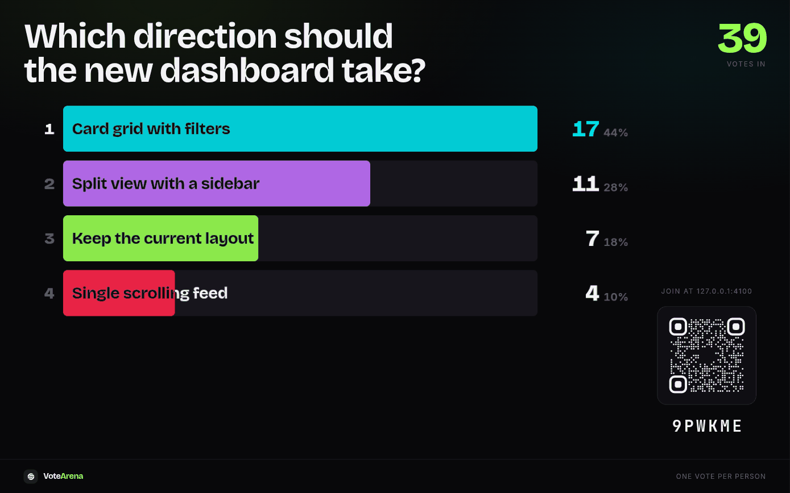
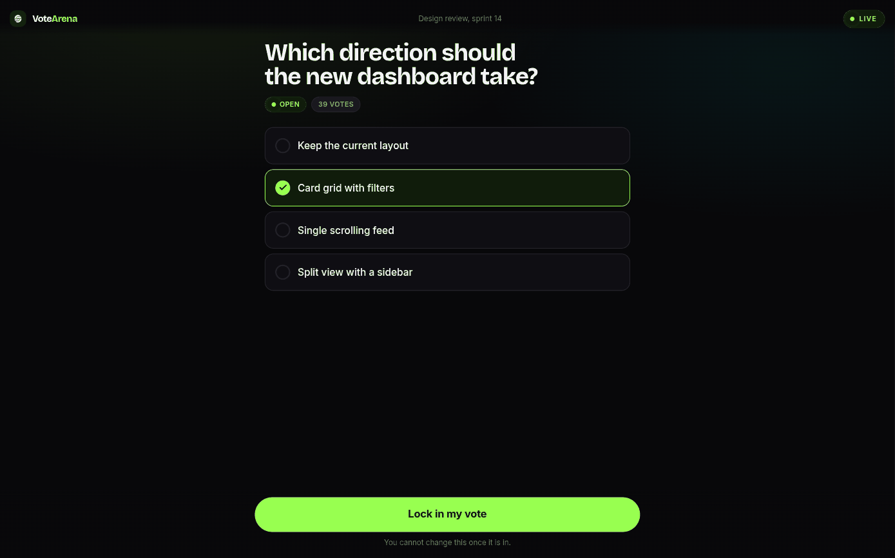
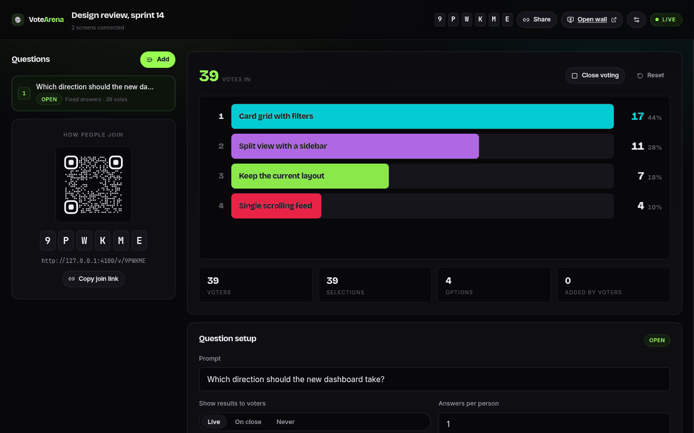
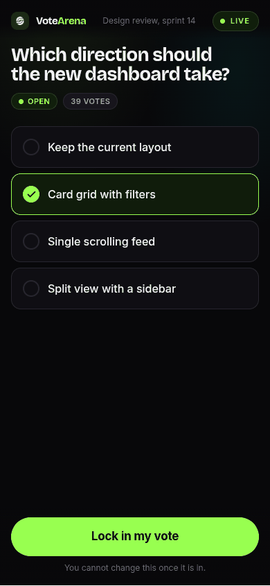
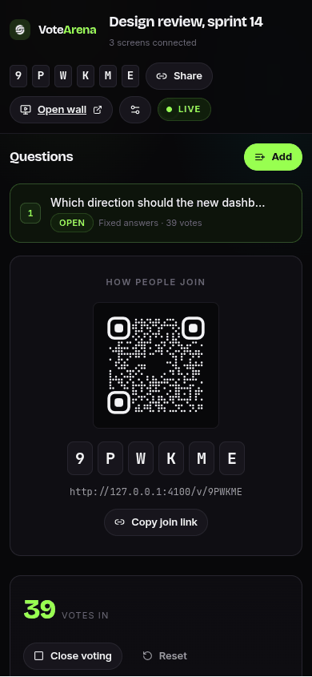

<div align="center">

<picture>
  <source media="(prefers-color-scheme: dark)" srcset="./docs/assets/adk_dev_logo_light.png">
  
</picture>

# VoteArena

**Live audience voting for a room with a projector. The host puts a code and a QR on screen, people vote from their phones with no sign-up, and the results move on the wall as the votes land.**


<br>


<br><br>

[](https://github.com/Dileepadari/VoteArena/actions/workflows/ci.yml)

**[Developer documentation](./DEVDOC.md)** &middot; [Screenshots](#screenshots) &middot; [Features](#features) &middot; [Getting started](#getting-started)

</div>

---

It exists because the usual options either make everyone create an account or make
the host read results off a spreadsheet afterwards. Here the answer appears while
the room is still watching.

---

## Screenshots

Real 1440x900 renders against the built server with 39 votes cast. The app ships a
single dark theme, set for a dim room with a projector in it, so there is one
gallery rather than a light and dark pair.

<table>
  <tr>
    <td width="33%" valign="top">
      
      <p align="center"><b>The wall</b><br><sub>What the room sees. Ranked, live, with the join code always on screen.</sub></p>
    </td>
    <td width="33%" valign="top">
      
      <p align="center"><b>Voting</b><br><sub>No sign-up. Pick an answer, lock it in, done.</sub></p>
    </td>
    <td width="33%" valign="top">
      
      <p align="center"><b>The host console</b><br><sub>Open and close questions, watch the count, change the settings live.</sub></p>
    </td>
  </tr>
</table>

### On a phone

The voter screen is the one that matters here: it is the only page most people in
the room will ever open, and it has to work on a phone on a bad connection.

<table>
  <tr>
    <td width="25%" valign="top">
      
      <p align="center"><sub><b>Voting</b><br>390 x 844</sub></p>
    </td>
    <td width="25%" valign="top">
      
      <p align="center"><sub><b>Host console</b><br>390 x 844</sub></p>
    </td>
    <td width="50%" valign="top"></td>
  </tr>
</table>

---

## Features

### Joining
- Three ways in, all pointing at the same session: scan the QR, type the six-character
  code, or open the link.
- Codes leave out `0`, `O`, `1`, `I`, `L` and `U`, so a character read off a projector
  is never ambiguous.
- No account, no app, no email. Opening the link is the whole process.
- One vote per person per question, enforced by a signed cookie that survives a
  refresh, a reload, and closing the tab.

### Question types
- **Fixed answers** - you write the options, people pick one. Results are a ranked
  leaderboard with live percentages, and bars slide past each other as the order changes.
- **Open field** - seed it with a list of names (paste a column from a spreadsheet, or a
  comma-separated list) and let people either pick one or type their own. Results are a
  bubble field where each answer's area is its share of the vote.
- Either type can take more than one answer per person.
- Typed answers merge on spelling: "José García", "jose garcia" and "JOSE  GARCIA" all
  land on one bubble, and a typed answer that matches an existing option joins it rather
  than splitting the vote.

### The results wall
- Built to be projected: one headline count, one visualisation, and the join details
  always on screen so latecomers can still get in.
- Bubbles drift continuously and can be dragged; the leader carries a halo.
- Updates arrive over a live channel, so nobody has to refresh anything.
- Keeps the screen awake, and has a full-screen button.
- Falls back to a correctly settled still image where animation cannot play - a
  background tab, or a viewer who has asked for reduced motion.

### Host controls
- Open one question at a time; opening a new one closes whichever was running.
- Close voting to freeze the result, or reopen it if you closed it too early.
- Reset a question to clear its votes and run it again. Seeded options survive; answers
  people typed do not.
- Add or remove options while a question is live.
- Choose when voters see results: **live**, **on close**, or **never**. The wall shows
  the number of votes in either way, so you can build suspense without hiding turnout.
- Rename, reorder, and delete questions.
- **Strict device check** (off by default) adds a second block on the same device
  signature. Useful when you expect people to try clearing their browser, but it can
  wrongly block two identical phones on the same Wi-Fi, so leave it off unless you need it.

## Roles

| Role | Can do |
|---|---|
| **Host** | Create a session, write questions, open and close voting, see true counts even when results are hidden, reset or delete. Holds the host key. |
| **Voter** | Join with a code, QR or link. Vote once per question. See results when the host allows it. |
| **Wall** | Read-only projector view. Needs no key; anyone with the code can open it. |

The host key is generated when the session is created and stored in that browser.
Opening the control room from a different browser makes you a spectator, not the host.
Keep the control-room link.

## The session lifecycle

```
draft ──open a question──> live ──end session──> ended
```

A session starts in **draft** and becomes **live** the first time a question is opened.
Ending it stops all voting but keeps the results; it can be reopened. Deleting removes
the session, its questions and every vote.

Each question moves through its own states:

```
draft ──open──> open ──close──> closed ──reopen──> open
```

**draft** questions are invisible to voters, including through the API, so nobody can
read ahead. **open** is the only state that accepts votes. **closed** freezes the count
and, for questions set to reveal on close, publishes it.

## Tech stack

React and TypeScript on the front, Express and SQLite on the back, with Server-Sent
Events carrying live updates. No external services. Details in
[DEVDOC.md](./DEVDOC.md).

## Getting started

See [DEVDOC.md](./DEVDOC.md#local-setup) for local setup and
[Deployment](./DEVDOC.md#deployment) for running it in production.
